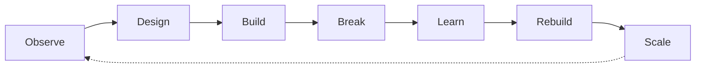

<div align="center">

# 👋 Murala Jayanth


<p>
  <strong>Full-Stack Developer · AI Engineer · ECE 2026</strong><br/>
  <em>Architecting real-world systems from idea to deployment</em>
</p>

[](https://jayanthmurala.vercel.app)
[](https://github.com/Jayanthmurala)
[](https://www.linkedin.com/in/jayanth-murala-0045b2281)
[](mailto:jayanthmurala1@gmail.com)

</div>

---

## 💡 About Me

I build **systems**, not just applications. My focus is on creating solutions that stand the test of time through:

```
✓ Long-term reliability
✓ Clean architecture
✓ Scalable backend logic
✓ AI as a controlled capability
```

My work lives at the intersection of **engineering, product thinking, and execution**.

---

## 🧠 Philosophy



**This loop defines every project I ship.**

---

## 🛠️ Technical Arsenal

<table>
<tr>
<td width="50%">

### Languages & Core


### Frontend


### Backend


</td>
<td width="50%">

### Databases


### AI & DevOps


</td>
</tr>
</table>

---

## 🚀 Featured Project

### [AI Career Coach](https://ai-career-coach-hazel-three.vercel.app) 🎯

**Full-Stack AI Career & Interview Platform** — A production-grade system built to replace generic interview preparation tools.

#### ✨ Key Features
- 💼 Personalized career insights & AI-powered resume feedback
- 🎭 Role-specific interview question generation
- 🎙️ Real-time voice-based mock interviews
- 🔐 Secure backend workflows for AI evaluation

#### 🔧 Tech Stack
```
Frontend: Next.js · React · Tailwind CSS
Backend:  Node.js · Express · MongoDB
AI:       OpenAI · Vapi Voice AI
Deploy:   Vercel · CI/CD Pipeline
```

<div align="center">

[](https://ai-career-coach-hazel-three.vercel.app)
[](https://github.com/Jayanthmurala/ai-career-coach)

</div>

---

## 📂 Other Notable Projects

<details>
<summary><b>🛒 outNow — Rapid E-Commerce Platform</b></summary>

<br/>

Built for high-concurrency user handling with enterprise-grade security.

**Features:**
- 🔐 JWT-based authentication & OTP login
- 🛍️ Full cart management system
- 💳 Stripe payment integration
- ⚡ Optimized for concurrent users

**Stack:** React · Express · MongoDB · Stripe

[](https://github.com/Jayanthmurala/E_commerce_project_1--Frontend--)

</details>

<details>
<summary><b>🎵 Full-Stack Music App — Distributed Systems Study</b></summary>

<br/>

Cloud-native music streaming platform with focus on performance.

**Highlights:**
- 🌩️ Cloud-native architecture
- ⚡ Redis caching for sub-100ms latency
- 📱 Mobile-first responsive design
- 🎨 TypeScript for type safety

**Stack:** Node.js · MongoDB · PostgreSQL · Redis · React · TypeScript

[](https://github.com/Jayanthmurala/SpotifyFrontend)

</details>

---

## 💼 Experience

### Product Assurance Intern @ Bharat Electronics Limited (BEL)
**Defense-grade embedded systems**

- 🔍 Functional & integration testing for critical systems
- 🐛 High-severity defect identification & documentation
- 🔄 Regression testing with hardware engineering teams
- 📊 Quality assurance in defense technology

---

## 🏆 Achievements

<table>
<tr>
<td align="center" width="33%">
<br/>
<b>WAVE-VIT Hackathon</b><br/>
2024
</td>
<td align="center" width="33%">
<br/>
<b>TechSprout-2K25</b><br/>
Coding Event
</td>
<td align="center" width="33%">
<br/>
<b>B.Tech ECE</b><br/>
Vishnu Institute of Technology
</td>
</tr>
</table>

---

## 🎯 System Philosophy

```python
class Life:
    def __init__(self):
        self.input = ["curiosity", "constraints", "pressure"]
        self.process = ["learn", "build", "fail", "refine", "ship"]
        self.output = {
            "systems": "that scale",
            "products": "that matter",
            "skills": "that compound"
        }
    
    def run(self):
        while True:
            self.execute(self.input)
            yield self.output
```

---

<div align="center">

## 💭 Closing Thoughts

> *"Good code solves problems.*  
> *Great systems prevent them."*

> *"I don't build projects.*  
> *I build things that can grow without me."*

**— Murala Jayanth**

---

### 📊 GitHub Stats


---

<sub>⭐ **Built with passion. Deployed with purpose.** ⭐</sub>

</div>
