<div align="center">

# 🫡 Jayanth Murala


<p style="margin: 20px 0;">
  <strong>Full-Stack Developer • AI Engineer • ECE Graduate 2026</strong><br/>
  <em>Architecting scalable systems from concept to production deployment</em>
</p>

[](https://jayanthmurala.vercel.app)
[](https://github.com/Jayanthmurala)
[](https://www.linkedin.com/in/jayanth-murala-0045b2281)
[](mailto:jayanthmurala1@gmail.com)


</div>

## 🎯 Overview

Experienced full-stack engineer specializing in building **production-grade systems** with emphasis on reliability, scalability, and maintainable architecture. My approach combines strategic product thinking with technical execution, focusing on AI-integrated solutions and enterprise-level backend systems.

```diff
+ End-to-end system architecture and implementation
+ Scalable backend development with performance optimization
+ AI/ML integration and production deployment
+ Clean code principles and maintainable design patterns
```

---

## 🛠️ Technical Expertise

<div align="center">

### 💻 Languages & Core Technologies


### 🎨 Frontend Development


### ⚙️ Backend Engineering


### 🗄️ Database & Caching


### 🤖 AI & Machine Learning


### 🚀 DevOps & Deployment


</div>


## 🌟 Featured Project

<div align="center">

### 🎯 AI Career Coach Platform


</div>

**Production-grade AI-powered career development and interview preparation system**

A comprehensive platform designed to modernize interview preparation through intelligent automation and personalized guidance. Built to handle production-scale traffic with robust backend architecture and real-time AI integration.

#### ✨ Key Features

```yaml
Personalization:
  - AI-powered career path analysis and strategy
  - Intelligent resume optimization with GPT-4
  - Role-specific skill gap identification

Interview System:
  - Dynamic question generation based on role & experience
  - Real-time voice-based mock interviews
  - AI evaluation with detailed feedback

Technical Architecture:
  - Secure backend workflows with validation
  - WebSocket integration for live sessions
  - Scalable microservices design
```

#### 🔧 Technical Stack

<div align="center">


</div>

#### 📊 Impact Metrics

- 🎯 **Real-time Processing:** < 2s response time for AI evaluations
- 🔒 **Security:** JWT-based authentication with role-based access control
- 📈 **Scalability:** Designed to handle 1000+ concurrent users
- ⚡ **Performance:** WebSocket integration for live interview sessions

<div align="center">

[](https://ai-career-coach-hazel-three.vercel.app)
[](https://github.com/Jayanthmurala/ai-career-coach)

</div>


## 💼 Additional Projects

<table>
<tr>
<td width="50%" valign="top">

### 🛒 E-Commerce Platform (outNow)


**Full-stack e-commerce solution with payment integration**

#### Highlights:

- 🔐 JWT + OTP authentication system
- 💳 Stripe payment gateway integration
- 🛍️ Real-time cart management
- ⚡ Optimized for concurrent users
- 📦 RESTful API architecture

#### Stack:


[](https://github.com/Jayanthmurala/E_commerce_project_1--Frontend--)

</td>
<td width="50%" valign="top">

### 🎵 Music Streaming Platform


**Cloud-native distributed system**

#### Highlights:

- 🌩️ Cloud-native architecture
- ⚡ Redis caching (60% load reduction)
- 📊 PostgreSQL + MongoDB hybrid
- 📱 Mobile-first PWA design
- 🔒 TypeScript for type safety

#### Stack:


[](https://github.com/Jayanthmurala/SpotifyFrontend)

</td>
</tr>
</table>


## 💼 Professional Experience

### 🏢 Product Assurance Intern

**Bharat Electronics Limited (BEL)** • _Defense Electronics Division_


**Responsibilities:**

- 🔍 Conducted functional and integration testing for critical defense systems
- 🐛 Identified and documented high-severity defects with reproduction steps
- 🔄 Performed regression testing with hardware engineering teams
- 📋 Participated in code reviews and quality assurance protocols


## 🎓 Education & Recognition

<div align="center">

### 🏛️ Bachelor of Technology in Electronics and Communication Engineering

**Vishnu Institute of Technology** • CGPA: 8.0/10 • Expected 2026

<br/>

### 🏆 Achievements & Awards

<table>
<tr>
<td align="center" width="33%">
<br/>
<strong>WAVE-VIT Hackathon</strong><br/>
<em>2024</em>
</td>
<td align="center" width="33%">
<br/>
<strong>TechSprout-2K25</strong><br/>
<em>Coding Competition</em>
</td>
<td align="center" width="33%">
<br/>
<strong>Active Contributor</strong><br/>
<em>GitHub Projects</em>
</td>
</tr>
</table>

</div>


## 🔄 Development Philosophy

```mermaid
graph LR
    A[🔍 Observe] -->|Requirements| B[📐 Design]
    B -->|Architecture| C[🔨 Build]
    C -->|Implementation| D[🧪 Test]
    D -->|Validation| E[📚 Learn]
    E -->|Analysis| F[⚡ Refine]
    F -->|Optimization| G[📈 Scale]
    G -.->|Iterate| A

    style A fill:#3B82F6,stroke:#1E40AF,color:#fff
    style B fill:#8B5CF6,stroke:#6D28D9,color:#fff
    style C fill:#10B981,stroke:#059669,color:#fff
    style D fill:#F59E0B,stroke:#D97706,color:#fff
    style E fill:#EF4444,stroke:#DC2626,color:#fff
    style F fill:#EC4899,stroke:#DB2777,color:#fff
    style G fill:#06B6D4,stroke:#0891B2,color:#fff
```

<div align="center">



</div>

This iterative methodology ensures continuous improvement and long-term system viability through data-driven decisions and user feedback integration.


## 💭 Engineering Principles

<div align="center">

> ### _"Good code solves problems. Great systems prevent them."_

> ### _"Build systems that scale beyond your presence."_

**— Murala Jayanth**

</div>

**Core Beliefs:**

- ✅ Maintain reliability under pressure
- ✅ Scale efficiently with demand
- ✅ Remain maintainable over time
- ✅ Serve user needs effectively

My goal is to create solutions that continue to deliver value long after initial deployment.


### 🤝 Let's Connect & Collaborate

[](https://jayanthmurala.vercel.app)
[](https://www.linkedin.com/in/jayanth-murala-0045b2281)
[](mailto:jayanthmurala1@gmail.com)
[](https://github.com/Jayanthmurala)

<br/>


<br/>

**⭐ Built with passion. Deployed with purpose. ⭐**

**© 2026 Jayanthmurala • Available for collaboration on innovative projects**

</div>
